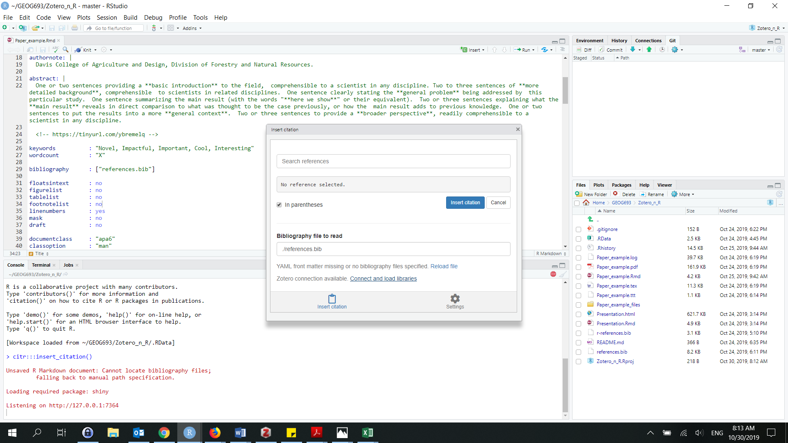
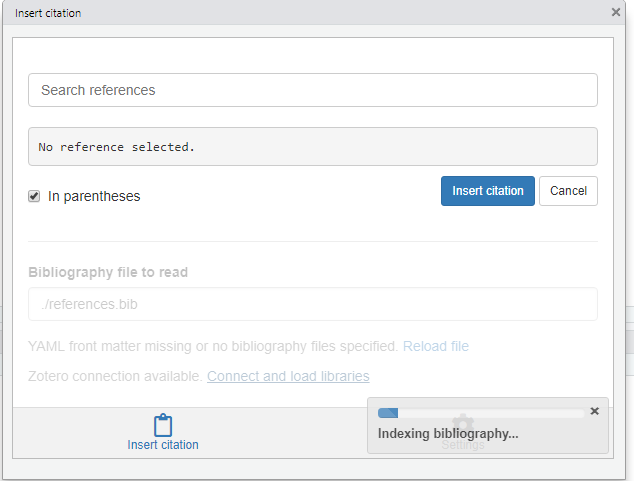
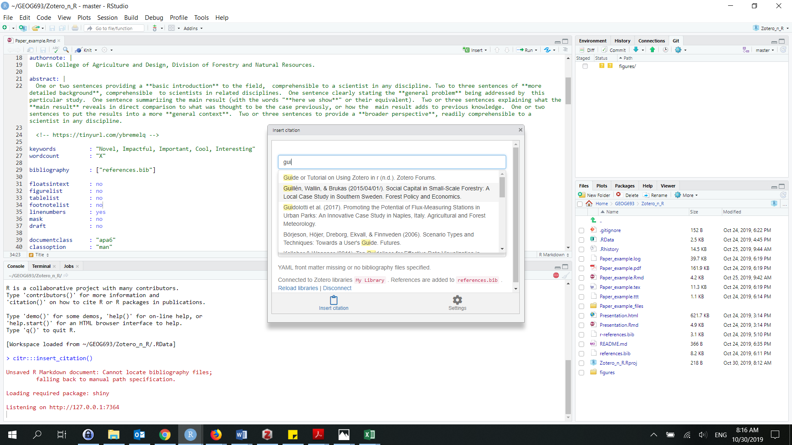

```{r setup, include=FALSE}
knitr::opts_chunk$set(echo = TRUE)
```

### Why?

Using R Markdown is a good way to show your analysis in R. Always having updated plots and directly importing tables and other results. It is also possible to  directly import the references that you have saved in your reference manager software.  

### Scientific Papers 

Writing scientific paper is already a challenging and time consuming part of our work as scientist. It is common to use a lot of our time editing texts to make them look nice by changing fonts; or wasting time by moving tables and/or figures around. 

In order to avoid those problems, and instead, focus on the content, while at the same time being able to reproduce papers in different formats, a program named LaTeX was created. However, working in LaTeX is quite difficult, and there is a pretty step learning curve to use it. 

Luckily, R developers have created packages that integrate R Markdown and LaTeX. This capacity of R studio makes our lives much easier so we should take advantage of them.  

### Zotero:
You will probable be working with hundreds of scientific references in your scientific career, so you need to use a Reference Manager Program to make your life easier. There are may options out there (e.g. Mendeley, EndNote), but a very popular, free and open source software is ZOTERO. You can download Zotero at http://www.zotero.com. 

The standalone Zotero program allows you to install extensions that link it to RStudio. You will also need to install packages in R so that R Markdown can read the libraries that you have in Zotero. 

### Steps:

**0. Pre-Requirements:**

- Internet connection.
- R, R studio and Zotero installed and up-to-date. 

**1. Installing the Papaja package:**

The Papaja (Preparing APA Journal Articles) package will help us create nice APA style manuscripts.  To install the package use the following code and read the explanation found in [@schooftimWritingReproduciblePapers2019] or [@frankRMarkdownWritingReproducible].  

```
# Install devtools package if necessary
if(!"devtools" %in% rownames(installed.packages())) install.packages("devtools")

# Install the stable development verions from GitHub
devtools::install_github("crsh/papaja")
```

The Papaja package creates a R Markdown template in which you can start writing your scientific manuscript right away. To create the R markdown file go to: **New file > RMarkdown > FromTemplate > APA article.** 
  
Note: To render this type ofR Markdown template you might need to have LaTeX tools/packages installed. The `tinytex` package is an LaTeX umbrella package [@yihuiPackageTinytexYihui] and it will find the LaTeX compoments needed for your specific case. Use the following code to install the package: 

```
# CRAN version
install.packages('tinytex')

# or the development version on Github
devtools::install_github('yihui/tinytex')
```

Besided the APA format. There seems to be any type of formats available already: look here:

https://github.com/rstudio/rticles

**2. Zotero compability:** 

There are two installations needed for this step (one in `R` and the other in Zotero)

- R: There are several ways to use references in R, but the `citr` package is popular and easy to use. Install it using this code: 
```
install.packages("citr")

``` 

- Zotero: You need to install the **BetterBibTex** Addin to Zotero. The Addin instalation file is found here: https://retorque.re/zotero-better-bibtex/installation/. Follow the steps in that webpage to download the file and add the extension to Zotero. 

After you have carried out both steps, you can access the Zotero library by clicking on the Addin button in the tools bar: **R > Citr**. A new window will open where you will search for the reference that you are looking for. 

These pictures show how inserting the pictures is done:







## Example

The file `Paper_example.Rmd` is an example of an R Markdown file that is formatted as a APA journal paper and has references within it. 

## Acknowledgment

Longer versions of the topics explain in this page can be found in the links below. These authors have taken a long time to create guides and packages, I acknowlege the full merit of their work and reiterate that this page is just an emsemble of the information they have posted.  

**APA template:**

https://www.timschoof.com/post/reproducible-papers-r/

https://daijiang.name/en/2017/04/05/writing-academic-papers-with-rmarkdown/

https://libscie.github.io/rmarkdown-workshop/handout.html

**LATEX and R:**

https://yihui.name/tinytex/

**Zotero and R:**

https://retorque.re/zotero-better-bibtex/installation/

https://christopherjunk.netlify.com/blog/2019/02/25/zotero-rmarkdown/

*Thanks for reading and let me know how to improve the page if you have suggestions. Email: lg0018@mix.wvu.edu.* 

References:
